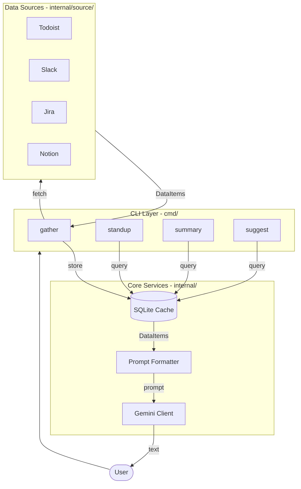
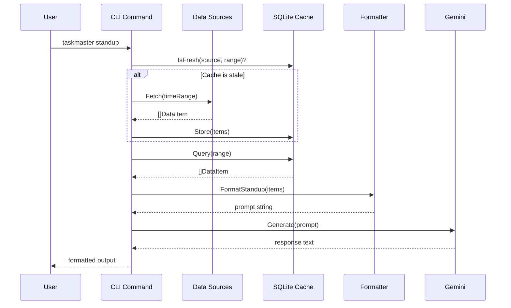
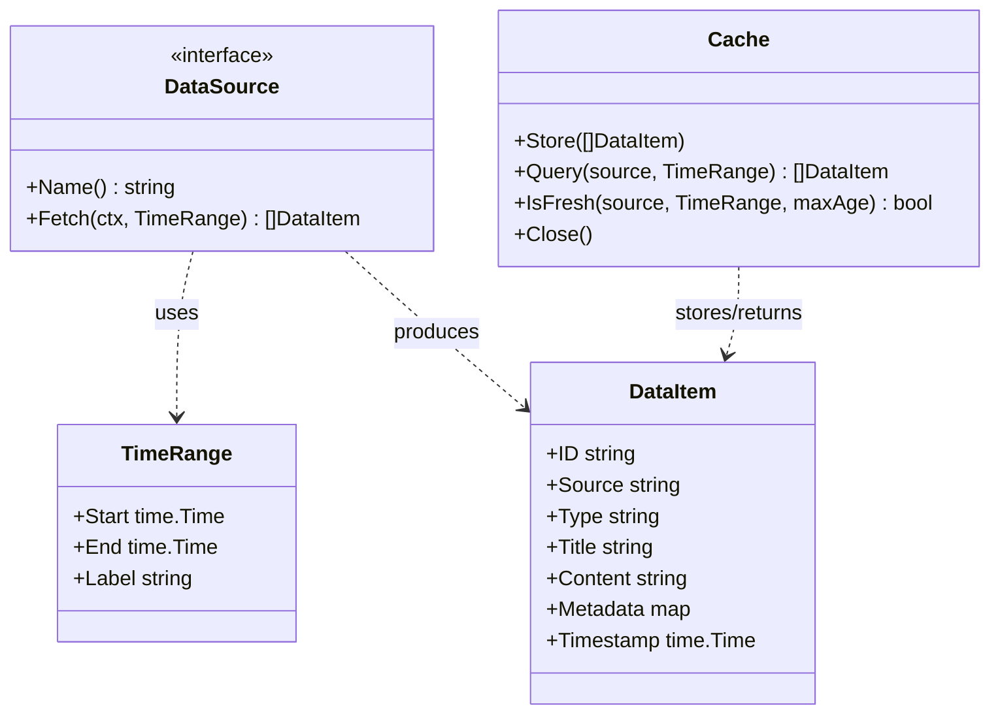
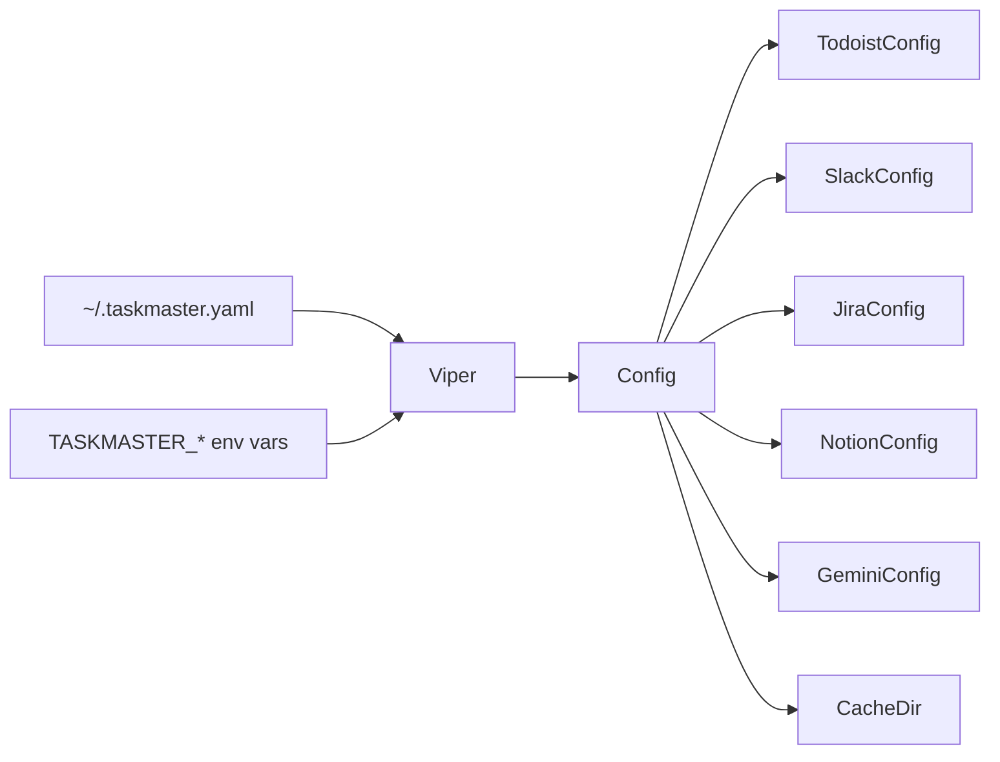

# Taskmaster Design

Taskmaster is a CLI tool that aggregates personal activity data from multiple services, caches it locally, and uses an LLM to produce actionable outputs like standups, summaries, and prioritization suggestions.

## High-Level Architecture

## Data Flow

## Core Types

## Configuration

Config is loaded via Viper from `~/.taskmaster.yaml` with `TASKMASTER_*` env var overrides.

Each source is only activated when its required config fields are non-empty. See `buildSources()` in `cmd/gather.go`.

## Cache Layer

SQLite database at `~/.taskmaster/cache.db` with a single `data_items` table:

| Column        | Type     | Notes                                 |
| ------------- | -------- | ------------------------------------- |
| id            | TEXT     | PK (with source)                      |
| source        | TEXT     | PK (with id)                          |
| type          | TEXT     | e.g. `task_completed`, `conversation` |
| title         | TEXT     |                                       |
| content       | TEXT     |                                       |
| metadata_json | TEXT     | JSON-encoded key-value pairs          |
| timestamp     | DATETIME | When the activity occurred            |
| fetched_at    | DATETIME | When this row was cached              |

Staleness is checked via `fetched_at` against a 1-hour window before re-fetching.

## Command Reference

| Command              | Default Range | Description                                    |
| -------------------- | ------------- | ---------------------------------------------- |
| `gather -r <range>`  | day           | Fetch from all configured sources and cache    |
| `standup`            | day           | Generate daily standup (auto-gathers if stale) |
| `summary -r <range>` | week          | Generate accomplishment summary                |
| `suggest`            | week          | Suggest priorities and time allocation         |

Ranges: `day`, `week`, `month`, `quarter`.
